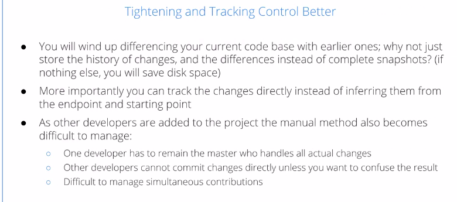
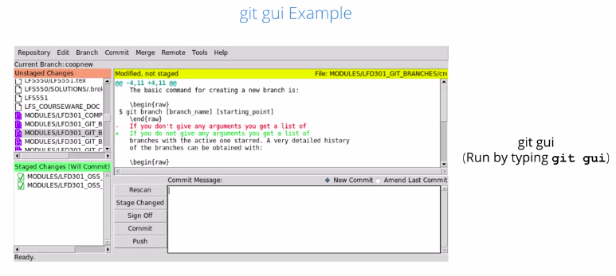
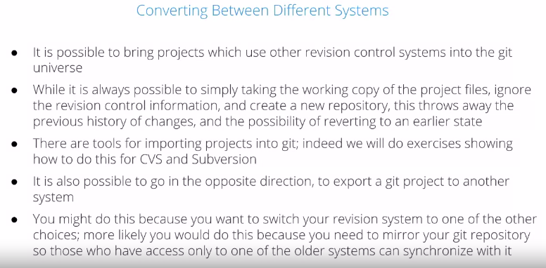
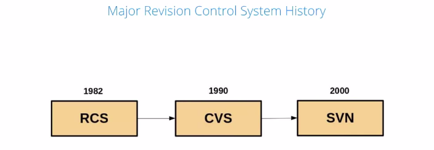
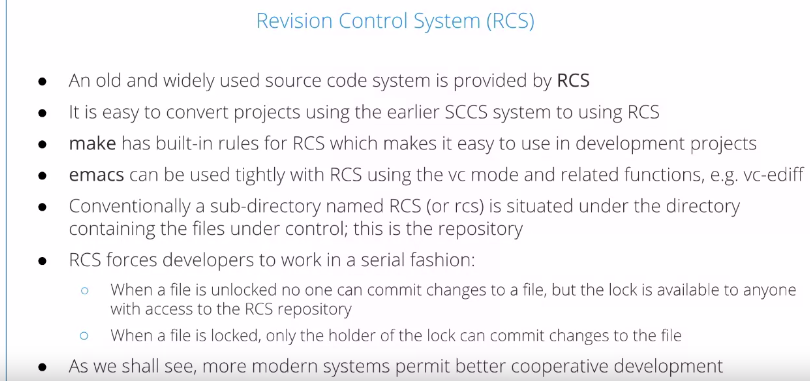
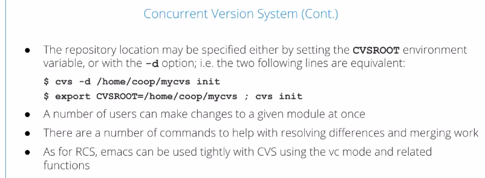
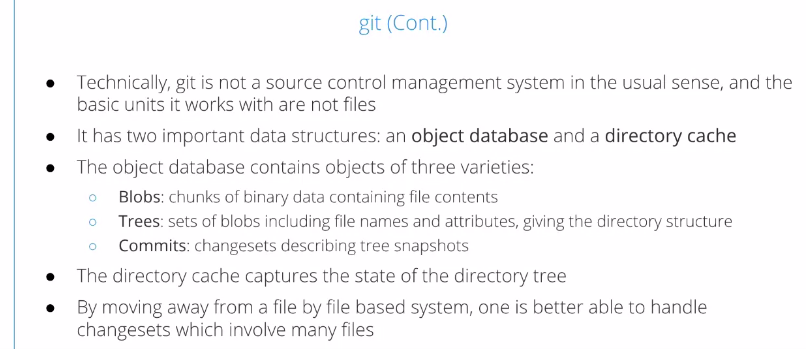

Using Git for Distributed Development
======================================

by The Linux Foundation

# Module 1

#
## Title: Git and Git Installation

## Introduction to Git

### Revision Control

* __Keep Track of Changes__
	* As you work on a project, you make changes. They accumulate, you fix bugs, you add new features, you optimize
		* Eventually, your codebase looks quite different than your starting point
	* Sometimes, however, you add a feature, you fix a bug, you make an enhancement, you think everything is better, but then, it turns out reality intervenes
	* A user, maybe even it's yourself, finds that your application has problems. It could be just it's used in a way that you didn't think about
	* You could hit an impossibly rare race conditions when you did not think about, when you're working on a simple computer, but when you get out faster hardware and you have multiple processors, more things can happen
	* A time can come when you realize that you have to go back to earlier stage to fix the problem
		* This can actually be a rather difficult thing to do, to find out exactly when things went wrong
			

			  
			

* __Manual Revision Control Methods__
	* To do this, we can keep frequent backups of our work
		* but it's nice to have some clean Intelligent Design, which can make this task much easier
			

			  
			

* __Tightening and Tracking Control better__
	* Also, you can track the changes directly instead of just getting them by comparing endpoint to starting point
	* As you add other people to the project and you're not the only developer, the manual method becomes very difficult, because you have to annoint somebody as the master 
		1. who handles all the actual changes
		1. other developers will probably have to feed changes to that master developer, if you don't want to get too confused
		1. it becomes difficult to manage simultaneous contributions by more than one person
			

			  
			

* __Distributed Development__
	* If you have distributed development to the extreme with a project, such as the Linux kernel, with thousands of developers all over the world working simultaneously on some of the same parts of the kernel and sometimes other parts of the kernel, even this notion of a central master repository of all wisdom starts to not make sense anymore
	* git is the one used by the Linux kernel, but also millions of other projects as has been shown by the growth of GitHub and there are many standard features of revision control programs, such as 
		1. being able to keep an accurate history
		1. a lot of changes to be able to go back to early releases
		1. coordinate conflicting updates from more than one developer, etc
			

			  
			

* What are some of the advantages of using a revision control system even if you are the only developer?
	1. You have an accurate list of changes between versions
		* Even when working by yourself, you can get confused about what and when you have done
	1. You have the ability to "rewind" to an earlier working state
		* This is very important for isolating problems
	1. You can save space as compared to just keeping archives of previous versions
		* For a large code base this can be important

### Graphical Interfaces for Git

* Graphical Interfaces
	* There are many graphical interfaces which can be used to view or maintain __git__ repositories, some of them are
		1. __git-gui__
			* __git-gui__ is very easy to use
			* Once it's installed, you just have to launch it within your main directory for your repository. You can 
				1. browse histories
				1. make changes
				1. commits
				1. work with the remote repositories
				1. compare branches
				1. do all sorts of other operations
		1. __gitk__
			* __gitk__ is a browser that can actually be invoked from within git-gui, but it's an older interface you probably won't use anymore
		1. __cgit__
			* __cgit__ is typically employed on web servers. So, you could get very efficient repository browsing. If you look at www.kernel.org, you can see that it's currently used for the Linux kernel, you can see it in operation
		1. __gitweb__
			* __gitweb__ is an older interface than cgit that's also used for some websites, but more people are moving over to __cgit__
				

				  
				

				

				  
				

* Which graphical interfaces for git are designed to run on a web server?
	1. __cgit__
		* cgit is meant to be run on a web server, not a local machine
	1. __gitweb__
		* gitweb is meant to be run on a web server, not a local machine

## Git and Revision Control Systems

### Revision Control Systems

* Converting Between Different Systems
				

				  
				

* Major Revision Control System History
	* The first revision control system, still in wide use, is RCS, which stands for Revision Control System
	* That was superseded in 1990 by CVS, Concurrent Version System, and by Subversion, SVN, in 2000
				

				  
				

* Revision Control Systen (RCS)
	* RCS is quite old, you won't generally find it today, unless there's some project that hasn't been updated for a very long time
	* Old Unix utilities have built-in rules for RCS, such as make and emacs
	* You typically have a sub-directory underneath, where your source files are, called RCS, that can change the control information, and RCS works in a serial fashion
		* You lock a file, you make changes to it, and then you put it back in and unlock it
		* So, while you've got the file locked, nobody else can work on it
		* So, while it's locked, only the holder can make changes to the file
	* So, this doesn't facilitate cooperative development with multiple users
				

				  
				

* Concurrent Version System (CVS)
	* The Concurrent Version Systems, CVS, was developed to deal with multiple users environment problem which was there in RCS
	* It's more difficult to learn, it has more commands and it's more complex because of its very nature
	* you have a centralized repository, it can be on a local machine, or it could be out on the Internet, and you never work directly on the files in the repository, you have your own working copy
		* When you finish, you check changes back in, or commit them, as we say, back into the repository
	* Any number of users can make changes to a given module at once, but that, of course, leads to the problem of how to resolve differences when people change the same parts of the code at the same time, and there are tools for doing it
	* Various utilities, such as editors like Emacs, can be used tightly with CVS, and that helps
				

				  
				

				

				  
				

* Subversion
	* Subversion came around in 2000, as a successor to it, though, in many respects, it looks a lot like CVS and its interface, and it's pretty easy to convert from CVS to Subversion
	* One enhancement is that you can also version directories, copies, and renames, not just the specific files and their contents, and also permissions can be versioned
	* You can set up a standalone Subversion server or you can make it as a service or a daemon
	* You can have it run under Apache, there are a lot of opportunities
	* Generally, it's a more enhanced version of CVS
				

				  
				

* git
	* Now, the Linux kernel development system had a lot of problems in its infancy about how to handle revision and version control
	* For long time, Linus just worked with email when he accepted things or didn't accept things
	* As the size of the project grew, it became important to have a coherent revision control system, and initially people used __BitKeeper__
		* __BitKeeper__ was a commercial project, but it gave a license for the Linux kernel development
	* There were disputes over what BitKeeper thought were violations of that license in 2005, and its use was withdrawn from the Linux kernel, and so git was developed as an alternative, and the original developer was Linus himself
	* Git functions quite differently than the other revision control systems it doesn't really care about files, it works with three kinds of objects, 
		1. blobs
		1. trees
		1. commits
	* __binary blobs__, which contain file contents and the name of a file is only one of the bits of data that's controlled in what are called __indexes__
		* So, for instance, if you have multiple copies of the same file in a repository, the binary blob that can change the file contents only has to be there once
	* If you have a changeset that handles many files, it's far more efficient, like a simple file rename or move does not generate removing an old file and putting a new one; it's just a tiny little change in the database
	* So, the idea here is there is no longer any central authoritative repository like CVS
				

				  
				

				

				  
				

> RCS was created in 1982, CVS was released in 1990, Subversion was released in 2000, and Git was initially released in 2005

