Using Git for Distributed Development
======================================

by The Linux Foundation

# Module 2

#
## Title: Working with Git

## Git Concepts and Architecture

### Concepts and Design Features

* __Concepts__
	* Many of the basic commands that git uses may be familiar, operations like 
			1. getting files
			1. committing changes
			1. comparing with earlier versions
			1. logging the history
		any serious revision control system has to have analogous commands and ability to do such thing
	* One important example is that in git, a file is not an essential object
	* Common operations, which may be rather cumbersome or difficult in other revision control systems, such as renaming a file or moving it from one directory to another, are very simple when using git
	* Git also uses these long hexadecimal identifiers that are associated with particular commits
		* They may look a little strange, but they're more than just a complicated name
		* They incorporate checksums that are used to verify the contents of the repositories and the changes that are made during a commit
			

			  <a href="javascript:void(0)" rel="noopener">
				 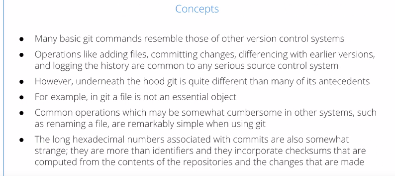</a>
			

* __Design Features__
	* **git** grew out of the Linux kernel development community, which is far-flung and widely distributed, it was designed to meet the needs of a very distributed development community
	* Some of the design features
		1. __Facilitate distributed development__
			* So, developers can work in parallel no matter where they are and don't have to constantly resynchronize. They can do that when it's convenient
		1. __Scales to handle large number of developers__
			* It doesn't become more complicated when there are large numbers of developers
		1. __Attain high speed and maximal efficiency__
			* Especially when working over the internet, it's nice to be able to avoid copying large files, and other information, to use compression, and not tie up networks, especially if project have people with high latency or slow speed
		1. __Maintain strong integrity and trust__
			* no unauthorized alterations can be made. You can ensure repositories are authentic ones and there's various kinds of cryptographic hash functions used to make sure this is true
		1. __Keep everyone accountable__
			* Everybody's accountable for all changes, each line of code, which has been changed, you can blame somebody for
			* So, it's very important when unraveling the history of a project, especially if there's some legal claim about who actually owns the code, etc
		1. __Keep immutable data in the repository__
			* You keep some data in a repository immutable, or unchangeable, such as the history of the project in some Orwellian fashion, go back and change the history
		1. __Make atomic transactions__
			* that means either all the changes go through or none do. You don't leave things in an undetermined or corrupted state
		1. __Support branching and merging__
			* It's very easy to branch into different branches, development branches, or subsystem branches. It's also easy to merge branches into the master branch or subbranches, etc
		1. __Make each repository independent__
			* Each repository is independent. Each repository has all its history in it. You have a free unencumbered license
		1. __Operate under a free unemcumbered license__
			* Git is covered by the GPL version 2
			* You can still develop things using git that have other licenses or even proprietary
				

				  
				

				

				  
				

### Git Architecture

* __Repositories__
	* A __repository__ is really just a __database__
	* This database contains every bit of information required to store a project, manages revisions, and show its history
	* It contains not just the complete working copy of the files, that are the project's contents, it actually has a copy of the repository itself
	* All this information, is stored in the __`.git`__ __subdirectory__ tree
	* Each repository also has __configuration parameters__, including the __author's name__, and __email address__, a __list__ of all the __branches__, both __locally__ and __remote__
	* When you clone a git repository, you make a copy of it that you want to use
		* This configuration information is not carried forward
		* That information is based on your site, because it contains information such as your name and email address
	* The two important data structures in the repository are
		1. the __object store__, that contains the full contents of the project
		1. the __index__, which changes dynamically as the project changes
			* It has a picture of the overall project structure at any given time
				

				  <a href="javascript:void(0)" rel="noopener">
					 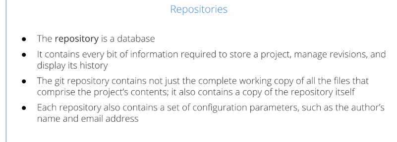</a>
				

				

				  
				

* __Objects__
	* There are four kinds of objects stored in what's called the objects store, and together, they contain everything you know about a project
		1. __Blobs__ (**B**inary **L**arge **OB**jects)
			* These are Binary Large Objects
			* That's where most of the bytes are
			* These are versions of files content that doesn't actually contain the file's name or any other metadata, just the content that's in files
		1. __Trees__
			* These record a blob identifiers, path names, metadata, etc
			* They are referred to sub-directories and objects within them
		1. __Commits__
			* Every time a change is made to a repository, a separate objects is made for the commit
				* That contains all the metadata describing the change
		1. __Tags__
			* These are optional, human-friendly names, that you can use in order to retrieve a particular point in the project history or commit, without having to type in those long hexadecimal numbers
				

				  
				

* __Content	vs Pathnames__
	* Git really doesn't care about file names. It works with contents, and it also doesn't care about files themselves
	* If you have two files and two directories with different names, there is only one binary blob stored, for instance
	* If the file changes, the hexadecimal string associated with it changes, and a new blob is associated with the new content
		* This makes comparisons extremely fast. Git only compares these hexadecimal identifiers, rather than actually compare the blobs
		* It's only if the hexadecimal identifiers are different, that the diffs will actually look at the actual file content
	* So, every time a file changes, you make a new binary blob
	* You don't have to keep a copy of a file at some other point in time, the way other revision control systems do
		* This tends to keep the size of the repository smaller
	* **File names** are just **metadata**
		* They're distinct from the contents
	* The **contents** of the **`.git`** subdirectory tree don't look at all like the working directories that they represent
	* You can easily remove all the working files in your project, and then just simply **restore** them with a **git restore** command just totally from that **`.git`** directory
				

				  <a href="javascript:void(0)" rel="noopener">
					 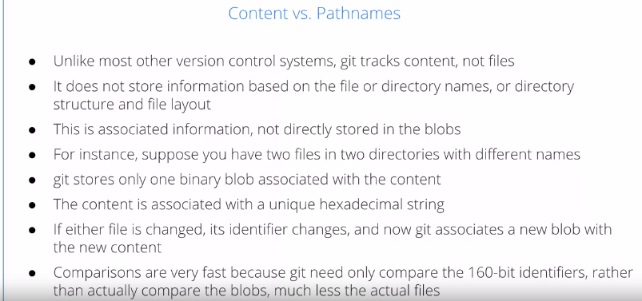</a>
				

				

				  
				

> __git__ keeps only one copy of the content in a binary blob until one of the files is changed

### Committing vs. Publishing

* __Committing vs. Publishing__
	* Other revision control systems often collapse these into one step. As soon as you make changes in the project, they're available for others if it's a distributed system like Subversion
	* A __commit__ is a local process. It just means you're saving the current state of all or part of your working project files in your local repository
		* You have a unique identifier, or it could just be a hexadecimal string, or you can have a tag that denotes that particular change
		* It's generally considered better practice to make a lot of small changes than a few large ones, but that's a decision you can make
		* No network access is required to do a commit
	* __Publishing__
		* When you decide to make them available to other folks, then you have to put them up on the Internet in some shape or form, and generally you do that by either doing a __push__ up to a remote repository or letting other people pull from your repository
			* You may send out a notice saying okay it's time to pull from me
			* Or, you can, you could do it by just using the patches
				

				  <a href="javascript:void(0)" rel="noopener">
					 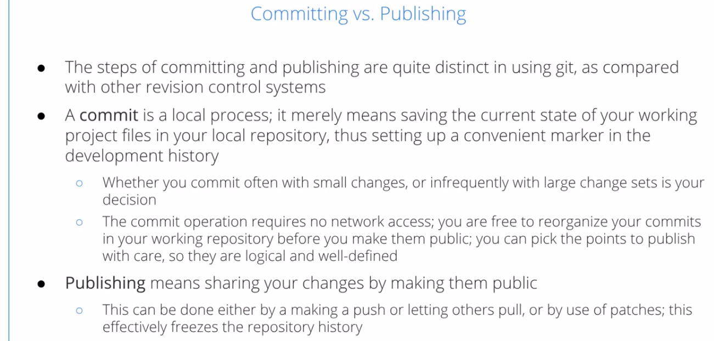</a>
				

### Upstream vs. Downstream

* __Upstream vs. Downstream__
	* Now, normally you consider the parent repository the __upstream__, or the master repository __upstream__
	* Whatever repository you're working on, which has probably been cloned from that parent, you consider __downstream__
	* __Note__ there's nothing in Git itself which really makes this distinction
		* It's really a peer-to-peer architecture
	* So, any repository which you send changes to, can be considered __upstream__, and any repository based on yours can be considered __downstream__
	* There can be multiple levels and sub-trees, etc, and any given repository can have both downstream and upstream relationships
	* __For instance__, if you have a subsystem, it may have an upstream master repository for the whole project, but there may be further sub-subsystems that are underneath it that have a downstream relationship
	* __Note__ that this distinction, is not architectural, it's just sociological
		* __For instance__, you can merge a development branch into a master branch, or you can merge your master branch into a development branch
			* There's nothing in the Git infrastructure that prevents you going in either direction
			* It's just workflow and convention that controls what's upstream and downstream
				

				  <a href="javascript:void(0)" rel="noopener">
					 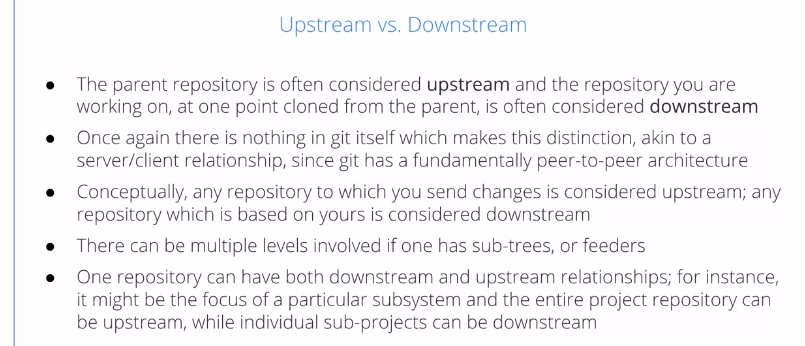</a>
				

> A repository can be both upstream and downstream with respect to various parts of a project infrastructure

### Forking

* Forking
	* The project forks when someone or a group of people take an entire project and split it
		* They may go off in another direction
		* Sometimes, this is called __branching__, but in git nomenclature, branch has a somewhat different meaning, as you can have, multiple branches within a given repository
		* The simplest example just being a __development branch__
	* All you have to do to create a fork is to have a clone, but when these are just not meant to be in general a permanent bifurcation or a fork of a project
	* Why would you fork?
		* There can be number of reasons for this, some are
			1. could have disputes among developers about the project direction
			1. what license you should be in
			1. there can be personal and political conflicts, etc
	* There are a number of important cases where there were Forks which were later healed
		* It's very easy to heal a fork
		* You just have to merge the two branches that have been created back together
		* in fact, structurally, every time you merge a branch back into the main repository, you're healing a fork (technically)
				

				  
				

> The project forks can be united when and if post-fork evolutionary differences are worked out

## Managing Files and the Inde

### File Categories

* There are 3 basic file categories
	1. Tracked Files
	1. Ignored Files
	1. Untracked Files
				

				  <a href="javascript:void(0)" rel="noopener">
					 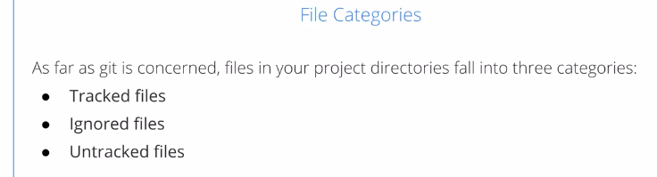</a>
				

* **Tracked Files**
	* **Tracked files** are the ones you really care about, those are the ones that constitute your project
	* They will already be in your repository in their current working state, if you have made all your commits, or if you haven't made commits yet, they are what we call **staged**, or **changed**, but not yet committed, until you commit them
				

				  <a href="javascript:void(0)" rel="noopener">
					 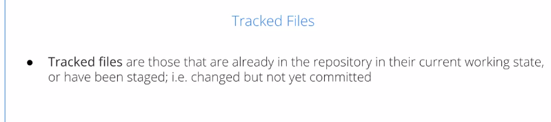</a>
				

* **Ignored Files**
	* The __ignored files__ are things you have explicitly told git not to add to the repository and keep track of
	* You can include in every directory a file called `.gitignore` where you list the files you do not want to track, the ones which should be ignored
		* For instance, if you have in `.gitignore` __*.o__, a file name ending with __.o__ will never be added to the repository
	* This file refers to all subdirectories below it, and not just the contents of this directory
		* So, as you make commits or look through the git repository, it descends through all the subdirectories paying attention to these files
	* It's possible to have negated rules in the ignore file. So, for instance, if I have __*.ko__, that would be a kernel module actually
		* I'm saying never add a kernel module to the repository
		* But if I have exclamation point before __!my_driver.ko__, that's an exception, It would mean that I want to add **my_driver.ko** to the repository
	* So, anything that is negated in .gitignore file is not ignored
				

				  <a href="javascript:void(0)" rel="noopener">
					 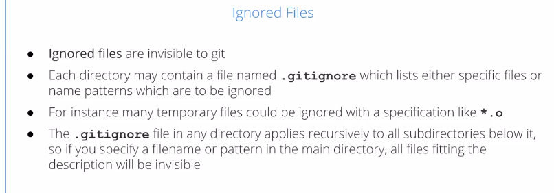</a>
				

				

				  <a href="javascript:void(0)" rel="noopener">
					 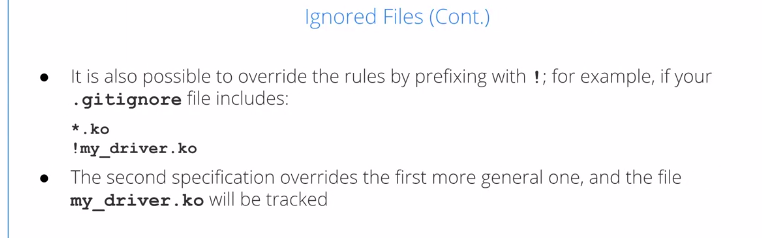</a>
				

* **Untracked Files**
	* Things which are neither tracked and are part of the repository, or explicitly ignored
	* So, there may be other files that are in your directory that are there temporarily, and you're playing with or they're notes to yourself, they would be in the category of untracked files
	* The common error that's made sometimes is to have a file that you actually want to add to the repository, but it's not being done so because of the `.gitignore` file
	* For an example, you may have a general rule saying don't add PDFs, they're products that I don't want in the actual repository cut, because I can always regenerate them, but you might have a figure that's a PDF that you need to add to the repository
		* when you commit, you'll have to use a "-f" option to explicitly force that file to be added
				

				  <a href="javascript:void(0)" rel="noopener">
					 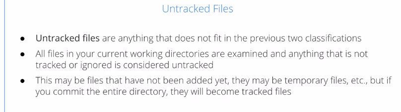</a>
				

## Commits

### Making a Commitment

* Commit Process
	* The commit process will be familiar from any version control system. That's when you make changes to a file or a group of files and you put them in the repository
	* When you make the commit in git, it creates a so-called commit object from the files in the index, and the commit object is placed in the object store
	* The files themselves are already in the object store when they are placed in the index
	* If you have new files in the commit, then new blobs are created, new directories result in new trees, any unchanged object is simply reused if its unchanged
		* So you really don't need much new storage
	* Git keeps the size of its repositories as small as possible
	* Furthermore, it's a __very fast process__ because you don't actually have to examine the different blobs completely
		* All you have to do is compare the hexadecimal identifiers to see if they are identical
		* If a hash describing a directory hasn't changed, nothing in any of its subdirectories has changed either
	* The __commits__ are __connected__ in an __ancestral__ or a __historical tree__
		* You can always pick well-defined points, but whether you do many small commits or fewer large ones is your choice, because __git does handle large numbers of small commits very efficiently__
	* when you use the __bisect tool__, you can find the points where bugs and regressions are introduced quite easily, and if you have small commits it makes it even easier to find
				

				  <a href="javascript:void(0)" rel="noopener">
					 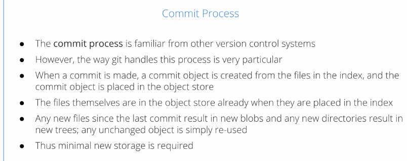</a>
				

				

				  <a href="javascript:void(0)" rel="noopener">
					 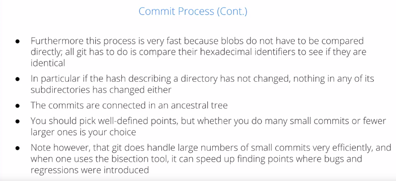</a>
				

## Branches

### Branches

* The use of branches is very important in git
* What is a Branch?
	* At some point you may want to break off from the mainline development and create a so-called independent branch
	* For example, suppose a major release of a product comes out
		* At that point you may want to make two new branches
			1. A __maintenance branch__ will be restricted to just fixing important bugs and serious performance bottlenecks, plugging security holes, and you would like to deploy that to the products that are being used in the field as often as is possible
			1. A __development branch__ has a different purpose that would be sort of the next branch
				* Things which are currently being developed as future features and optimizations but aren't ready for public release would go in this development branch to be shaken out over time and debugged, etc, until the next major project release is ready
	* You can also have a separate branch just to isolate a particular area development, work on a certain sub-system, a certain architecture, a certain way of using a product, etc,and be able to work in isolation there without having to constantly absorb the changes made in other branches or parts of the project as long as you can merge them all later
	* It's both quite easy in GIT to make branches and it's quite easy to do the inverse process of merging the branches back in
	* Now, the whole way this is done was inspired by the Linux kernel development community because there there are many parallel branches, 
		1. you might have one for network drivers
		1. you have one for USB
		1. you have one for networking
		1. you have one for a block device, etc
		* In the git way of doing things, the master branch is the collection point through these changes and you merge them from time to time in the master branch
	* You can have many branches in a project active at the same time but when you are currently working there's only one active branch that owns your working files in your directories at a given time
		* When you switch from one branch to another, you change the actual files in your directory
					

					  <a href="javascript:void(0)" rel="noopener">
						 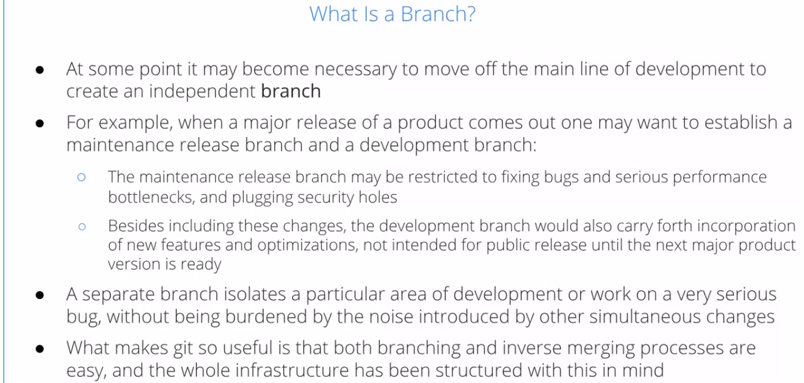</a>
					

					

					  
					

* Branch Names and Tags
	* Now, besides branch names we also have tags
	* __tags__ is just an __identifier__, it's a __nickname__, you put in any given branch and anytime to indicate a certain stage of development so that you can check out the tag and that brings you back to the point where you made the tag
	* You typically have a development, a debug, or a stable branch, etc, but normally you do not change the name of the branch
	* If two branches share a common ancestor, they share all the tags that were in existence before the separation
	* If you have two parallel branches that adopt a tag of the same name after they have separated from the master branch and then you merge in these two parallel branches you will have a conflict that will have to be dealt with but it's not a difficult thing to do
					

					  <a href="javascript:void(0)" rel="noopener">
						 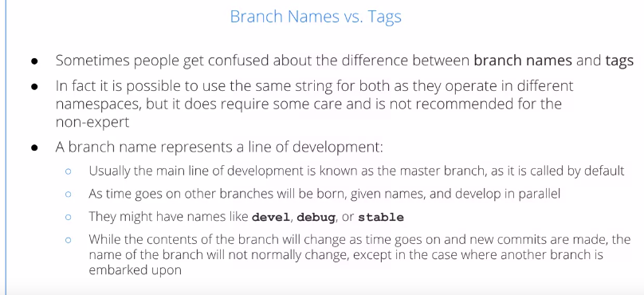</a>
					

					

					  <a href="javascript:void(0)" rel="noopener">
						 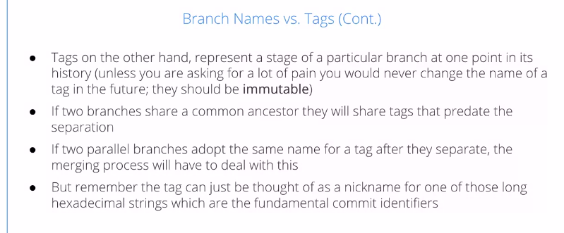</a>
					

## Merges

### What is Merging?

* Merging
	* Any revision control system has to deal with the problem of merging in changes into the master repository or branch
		* This will happen when you have more than one developer working on a project, but even if you have only one developer, they perhaps will have a staging branch or a development branch that they want to merge into the main project branch after some period of time and so the problem will still exist
	* If there's more than one merge going on, it's possible that changes will conflict with each other
	* Files may have changed since the branch was last synchronized with the master branch, and so the same file or group of files may have changed in two different changesets, and so, the basic problem in merging is to make sure you can resolve any conflicts
	* You can get problems if two different authors try to fix the same bugs
		* There's only one way to find this sort of conflict that can exist is by examining the actual code, or whatever is in the project to make sure that the work of the two people doesn't conflict with each other in practice
	* Git is designed to have a lot of good tools for examining this sort of things, but you still need human beings in order to resolve conflicts
					

					  
					

