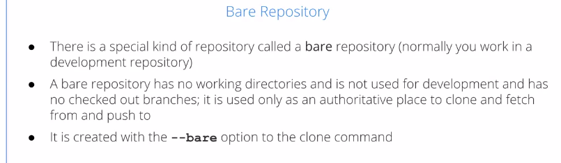
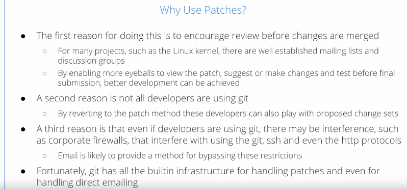
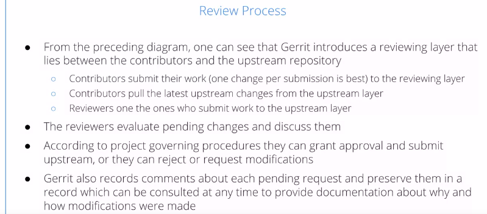

Using Git for Distributed Development
======================================

by The Linux Foundation

# Module 3

#
## Title: Working with Other Developers

## Managing Local and Remote Repositories

### Module 3 Overview

* The whole reason Git exists is because Linus needed a method to work with people all over the world, and be able to share work in a coherent way and keep good track of what exactly was being done
* So, while you can use Git just on your local machine as a convenient way to store a history of changes, as well as backups of earlier versions, its true strength comes in the ability to work with others
* A **patch** is a text file which contains lines, which should be added to a file, and line should be removed with some identifying information to tell you exactly where to make these changes

### Working with Distributed Repositories

* __Working with Distributed Repositories__
	* Many other revision control systems are built around the concept of a central authoritative repository, or location, which is the authoritative hub that individual developers work with
	* With git, there is no such thing
		* There is no one repository that has a central role structurally and may have one politically, but not structurally
	* There's at least three situations in which this model makes sense
		1. You have developers working autonomously
		1. Developers may be separated across large
		1. Even global networks
	* So, you may have a local group of developers sharing a particular repository, rather than everybody around the whole world
		* You may have diversion projects with sub-areas that have their own repositories, maybe it's on networking, maybe it's on USB devices, etc, with an idea that once things coalesce some, you'll merge those changes into the main project
	* There's a very strong infrastructure in git for branching, merging multiple repositories, and the complicated logistics of distributed development is exactly what git was designed for
				<p align="center">
				  <a href="javascript:void(0)" rel="noopener">
					 </a>
				</p>
* __Operations Involved in Handling Remote Repositories__
	* The essential operations involved when handling remote repositories rather than just the local ones, are
		1. __Cloning__
			* Cloning, which just simply means copying the entire repository
			* __git clone__ is the obvious command for this
		1. __Pulling__
			* You already have a copy of the repository you want to pull in changes from the remote repository. They keep what's called your tracking branch up to date
			* This is done with the __git pull__, and __git fetch__ commands
		1. __Pushing__
			* When you have changes you want to push through a remote repository, if you have the privilege to do so
			* The command is __git push__
		1. __Publishing__
			* Publishing means making your repository available for others to clone the pull from, to push to, etc
	* __Git__ will use tracking local branches to handle the content, remote repositories who have a branch of the same name, in your local situation as there is in the remote server
	* There are local branches or proxies or references for the branches in the remote repositories
				<p align="center">
				  <a href="javascript:void(0)" rel="noopener">
					 </a>
				</p>
* __Bare Repositories__
	* There's a special kind of repository called the bare repository
	* Essentially, this is a repository that has only the `.git` directory, and doesn't have a working copy, because it doesn't need it
	* It's only used as a place to call and fetch from and push to, and it's created with the `--bare` option to the clone command
				<p align="center">
				  <a href="javascript:void(0)" rel="noopener">
					 </a>
				</p>


## Using Patches

### Why Use Patches?

* __Integrating Patches with Git__
	* Git is a peer-to-peer system
		* You have changes falling back and forth between developers and their repositories, and there are push and pull and fetch operations that help do this
	* It can work with at least three protocols, 
		* Git
		* HTTP
		* Secure Shell (SSH) protocols
	* However, it's even easier sometimes to just submit a change through a patch
	* Patches predate the use of Git, and other revision control systems
	* Patch is a plain text file that shows the lines which have changed by giving the new lines with a __plus sign__, marking the lines which are being removed by the __minus sign__
				<p align="center">
				  <a href="javascript:void(0)" rel="noopener">
					 </a>
				</p>
* __Why Use Patches?__
	* Reasons for using Patches are
		1. The first one is, it's an easy way for people to review the changes before they emerge, then often people will simply examine the patch visually without even trying it and make suggestions about co-changes or see bugs without even actually trying in the code, etc
			* There are mailing lists and discussion groups, where people can have a balanced view of this
			* The more eyeballs that view the patch, perhaps you can make improvements before you actually really try if any final submission or testing.
		1. Secondly, it's not a requirement for open source projects that people will be using Git
			* If you only use various Git operations to submit changes, you're excluding users and developers who are just working directly with the source without using Git as a revision control system
		1. There are many cases where there may be corporate firewalls, etc, that stand between particular developers and the community they're working with and they interfere with the various protocols, but generally, they'll still be able to send the Emailing
	* Git actually has all the infrastructure you need for handling patches and even emailing them
				<p align="center">
				  <a href="javascript:void(0)" rel="noopener">
					 </a>
				</p>

### Emailing

* __git send-email__
	* Git has a built-in __send-email__ command, so that if you want to send a message for submitting a patch to the Linux Kernel mailing list, you say __git send-email -to__, you give the right address for the kernel mailing list, and then, the name of the patch
				```bash
				>>> git send-email -to linux-kernel@vger.kernel.org 001-first-commit.patch
				```
		* You'll be prompted for some information probably, such as who the message is coming from
		* You may have to do some additional configuration agent in your mail agent. Your outgoing mail agent, and some of this may require the privilege of a super user
				<p align="center">
				  <a href="javascript:void(0)" rel="noopener">
					 </a>
				</p>
* __Other Email Clients__
	* You can also use any conventional email client, such as __Gmail__, __Thunderbird__, __Evolution__, __Mutt__, __Claws__, etc
		1. First of all, you need to turn off any special html encoding. It should just be sent as plain text
		1. You also have to turn off any additional formatting, such as line wrapping
		1. Generally, you want to inline the patch directly in email rather than have it as an attachment, that's an extra step for people to take in order to view things, which can irritate people, and it can expose other idiosyncrasies due to the email client, and how it handles attachments
			* Even for very long patches, attachments are really not a good idea
	* You probably should consider whether you should just send them in with a normal git pull, or push request
				<p align="center">
				  <a href="javascript:void(0)" rel="noopener">
					 </a>
				</p>

## Advanced Git Interfaces: Gerrit

### Gerrit

* __Models of Distributed Development__
	* Within git, we have well-established methods of workflow
		* They are actually rather flexible and projects can use vary different approaches according to their particular taste and needs
	* Usually, you have a cycle where developers make changes in the code, probably in a development branch that's either shared with the others, or is unique to a particular developer or group of developers
	* Changes are committed to that development branch and then, those changes are published through push or pull requests
	* They are reviewed and merged if necessary into the master branch, or they are sent back for further work.
	* This method works pretty well if you have a top-to-bottom pyramid type of view of things, where each subsystem has a 
		* clear maintainer or a group of maintainers managing their work, and that manager has the ultimate authority over what happens to any changes in their subsystem before they pass them up the pyramid to a higher level of the project
				<p align="center">
				  <a href="javascript:void(0)" rel="noopener">
					 </a>
				</p>
* __Simplified Git Workflow__
	* You have an upstream repository and contributors directly send pushes, fetches and pulls to that upstream repository
	* They are reviewed either by the benevolent dictator or by sub-maintainers, and they are sent up and down
				<p align="center">
				  <a href="javascript:void(0)" rel="noopener">
					 </a>
				</p>
* __Gerrit__
	* A tool such as Gerrit comes in when you have a more dispersed view
	* You may want to have multiple reviewers who are doing reviews for instance at the same time, and this architecture is designed to formalize this procedure
		* In order for Gerrit to work well, it's good to have only one change per commit, rather than a large block of them
		* It makes it easier to review and modify, reject or accept each one on its own merits instead of having to take the whole thing at once
				<p align="center">
				  <a href="javascript:void(0)" rel="noopener">
					 </a>
				</p>
* __Git Workflow with Gerrit__
	* We have the upstream repository, and at the bottom, the contributors, but in the middle, we have a box that is labelled Gerrit Review
		* So, contributors send their changes or push the changes into the Gerrit review, and Gerrit Review decides whether to send them back or submit them to the upstream repository, and contributors fetch and pull from the upstream repository
			* so there's this other layer in between, that is used at least for submission of changes, but contributors still pull things down from the upstream repository directly
				<p align="center">
				  <a href="javascript:void(0)" rel="noopener">
					 </a>
				</p>
* __Review Process__
	* The reviewers can work as a group or a committee to evaluate the pending changes and discuss them
	* There will be governing procedures within the project about how they can grant approval or submit upstream , or reject or request modifications
	* it records the comments about each pending request, and keeps a good record that can be consulted at any time to give documentation about the modifications and about why and how they were made
	* There are many other tools that can be used for more complicated events, workflows in Linux
				<p align="center">
				  <a href="javascript:void(0)" rel="noopener">
					 </a>
				</p>
* For non-elaborate projects, the usual method of dealing with contributions is:
	* Contributors work directly with the upstream repositories, often passing their work through a maintainer for review, modification, or rejection
* More elaborate processing tools such as Gerrit:
	* Introduce a structured reviewing layer between contributors and upstream, more elaborate than just a maintainer
* Situations when maintaining separate repositories makes sense:
	1. A developer is working autonomously
	1. Developers are separated across a large network
	1. There are divergent projects or subareas that are worth developing deeply on their own, with the idea of eventually merging changes that are found to be beneficial to the main project
* Before you publish your revisions, you should first make sure your repository is clean and committed up to date